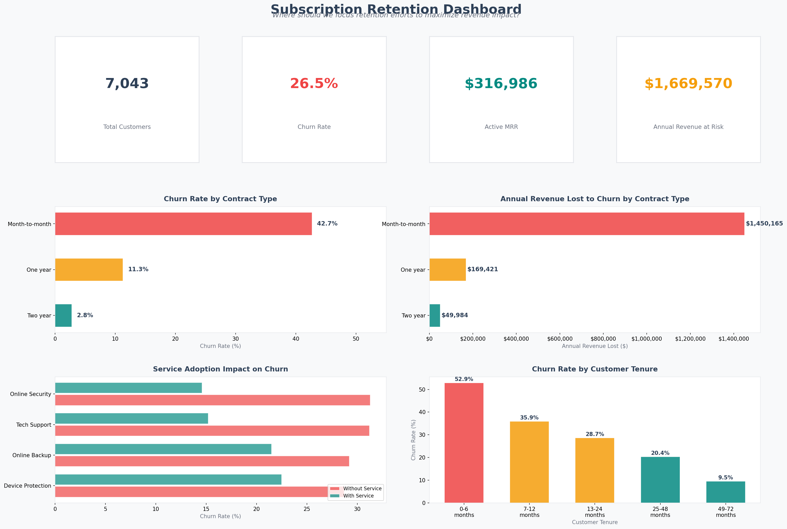
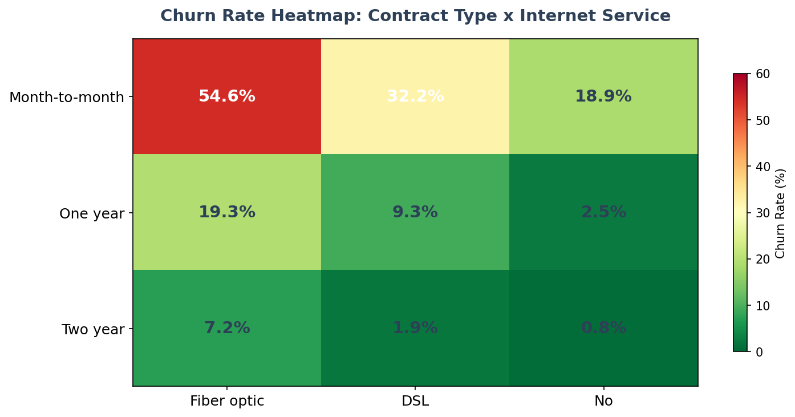
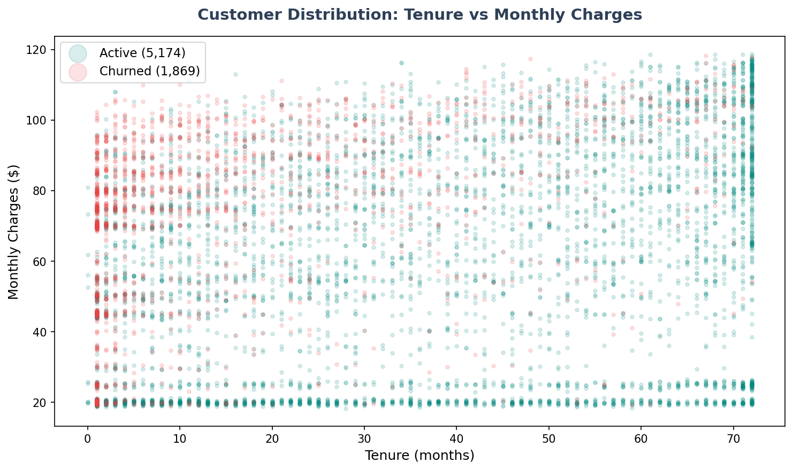
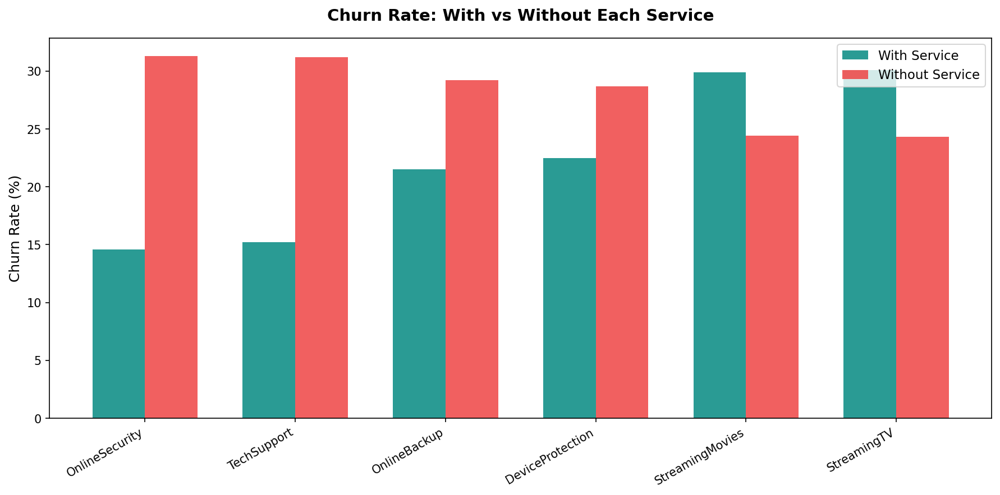
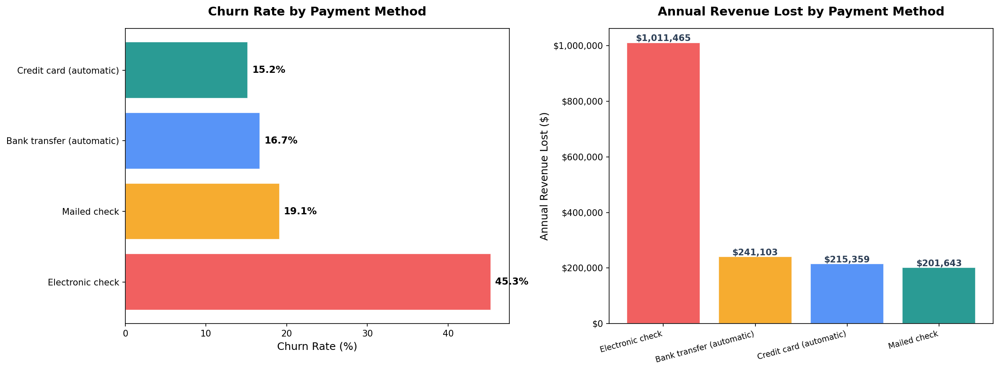
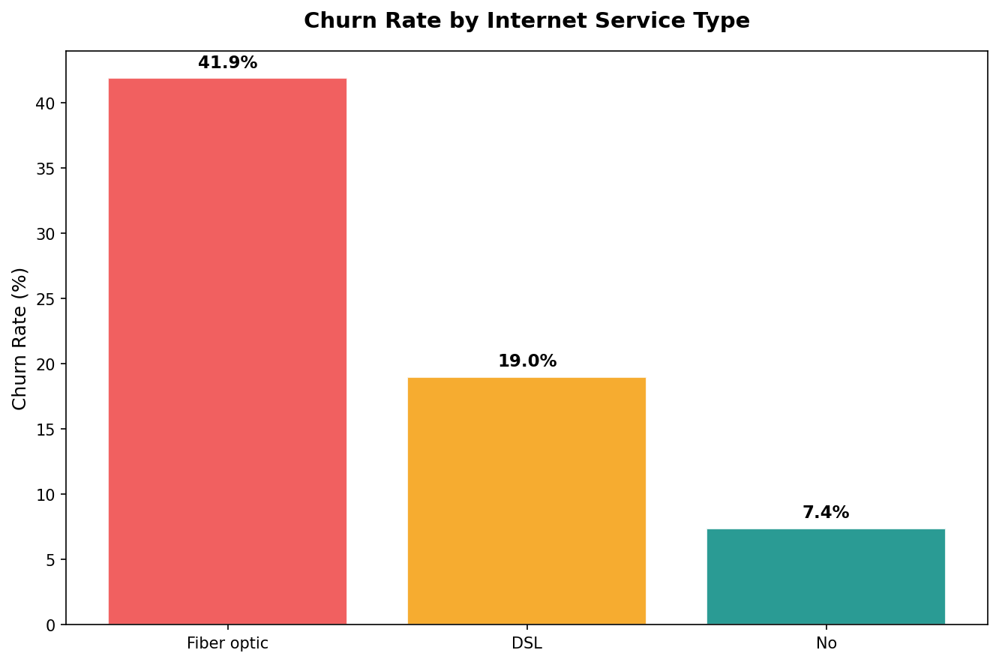
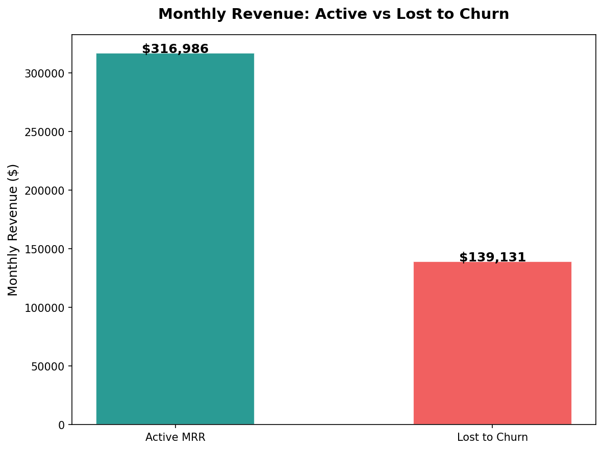

# Subscription Churn Analysis

A product analytics case study analyzing 7,043 real customer records from a subscription service to identify churn drivers, quantify revenue impact, and deliver prioritized retention recommendations. Combines an executive dashboard with deep-dive analysis across contract types, service adoption, payment methods, and customer segments.

## The Business Question

Where should a subscription business focus retention efforts to maximize revenue impact? This analysis answers that by identifying which customer segments churn the most, which product levers reduce churn, and where the largest revenue losses are concentrated.

## Executive Dashboard

A single-view dashboard designed for cross-functional stakeholders — KPIs at the top, the two highest-impact dimensions (contract type and tenure) in the middle, and the two strongest retention levers (service adoption and revenue concentration) at the bottom.



## Dataset

IBM Telco Customer Churn dataset (7,043 customers) with contract types, service subscriptions, tenure, payment methods, charges, and churn status. Source: [IBM/telco-customer-churn-on-icp4d](https://github.com/IBM/telco-customer-churn-on-icp4d/blob/master/data/Telco-Customer-Churn.csv)

## Analysis Sections

### 1. Churn Risk Heatmap (Contract x Internet Type)
Identifies the highest-risk segment: month-to-month fiber optic customers churn at 54.6%, while two-year DSL customers churn at 1.9%. The heatmap shows that both dimensions compound — the combination matters more than either factor alone.



### 2. Customer Value Segments
Churned customers paid more on average ($74.44/mo vs $61.27/mo) but had much shorter tenure (18 months vs 38 months). The scatter plot reveals that churn concentrates at high monthly charges and low tenure — a price sensitivity pattern among newer customers.



### 3. Service Adoption Deep Dive
Online Security and Tech Support show the strongest churn reduction (15–17 percentage points lower churn when adopted). Streaming services show the opposite pattern — higher churn among subscribers — likely because they increase monthly charges without adding retention value.



### 4. Payment Method Analysis
Electronic check users churn at 45.3% — nearly 3x the rate of auto-pay methods. This likely reflects failed payments or billing friction rather than a customer preference issue.



### 5. Internet Service Type
Fiber optic customers churn at 41.9% despite paying the highest average monthly charges ($91.50). Premium pricing without proportional retention investment creates the company's largest revenue leak.



### 6. Revenue Impact
$139,131 in monthly revenue lost to churn, or $1,669,570 annually. This is the cost of inaction — every month without retention improvements, this number compounds.



## Recommendations (Priority Order)

1. **Convert month-to-month to annual contracts** — The churn gap between month-to-month (42.7%) and two-year (2.8%) is the single largest lever. Aggressive annual pricing would have the highest ROI of any retention initiative.

2. **Bundle Online Security and Tech Support into base plans** — 15–17 percentage point churn reduction. Making these default rather than opt-in changes the retention math for every new customer.

3. **Invest in first-6-month onboarding** — 52.9% of new customers churn in this window. Early engagement and value demonstration during this period would reduce the largest source of churn volume.

4. **Migrate electronic check users to auto-pay** — Highest churn rate among payment methods (45.3%). Auto-pay reduces involuntary churn from failed payments.

5. **Review fiber optic pricing** — Premium customers are churning at premium rates. The value proposition needs to justify the price, or the price needs to reflect the retention reality.

## Tech Stack

- Python (Pandas, NumPy, Matplotlib)
- Real-world dataset (7,043 customer records)

## How to Run

```
pip3 install pandas matplotlib numpy
python3 analyze.py
```

Charts are saved to the `/charts` directory.

## Connection to dbt Project

This dataset is the same one modeled in my [dbt + Snowflake project](https://github.com/SavitaOkhuysen/saas-subscription-analytics), where the data is structured with staging, intermediate, and mart architecture and tested with 20 data quality tests. This project provides the analytical and visualization layer: exploring the data, identifying patterns, and making business recommendations.
